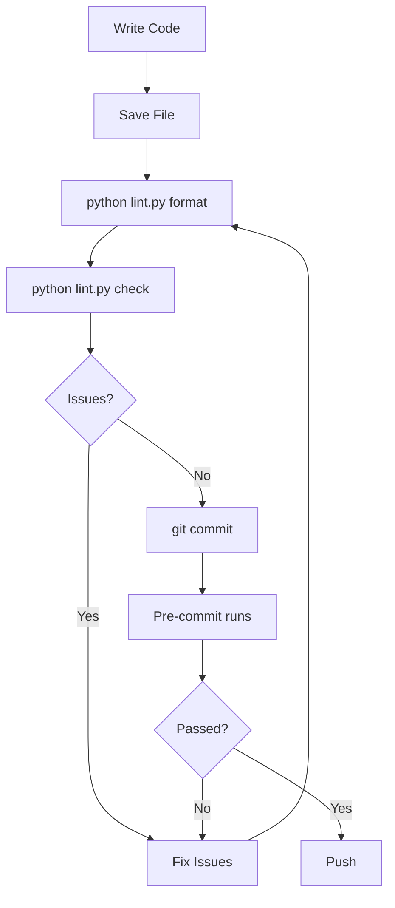

# Code Quality & Linting Guide

**Personal Password Manager - Automated Code Quality Tools**

This guide explains how to use the linting and formatting tools configured for this project.

---

## Table of Contents

1. [Quick Start](#quick-start)
2. [Tools Overview](#tools-overview)
3. [Configuration Files](#configuration-files)
4. [Using the Lint Helper](#using-the-lint-helper)
5. [Individual Tools](#individual-tools)
6. [Pre-commit Hooks](#pre-commit-hooks)
7. [CI/CD Integration](#cicd-integration)
8. [Common Issues](#common-issues)

---

## Quick Start

### First Time Setup

```bash
# Install all tools (already done if you've run pip install -r requirements.txt)
pip install black flake8 isort mypy pylint bandit pre-commit

# Install pre-commit hooks
pre-commit install
```

### Daily Usage

```bash
# Format code before committing
python lint.py format

# Check code without modifying
python lint.py check

# Run full quality check
python lint.py full
```

---

## Tools Overview

### 1. **Black** - Code Formatter
- **Purpose:** Automatic code formatting (opinionated, consistent)
- **Config:** `pyproject.toml` → `[tool.black]`
- **Line Length:** 100 characters
- **What it does:**
  - Formats code to consistent style
  - Handles indentation, spacing, quotes
  - Makes code look uniform across the project

**Example:**
```python
# Before
def foo(x,y,z):
    return x+y+z

# After (Black formatted)
def foo(x, y, z):
    return x + y + z
```

### 2. **isort** - Import Sorter
- **Purpose:** Organizes import statements
- **Config:** `pyproject.toml` → `[tool.isort]`
- **Profile:** Black-compatible
- **What it does:**
  - Groups imports (standard library, third-party, local)
  - Alphabetically sorts within groups
  - Removes duplicate imports

**Example:**
```python
# Before
from pathlib import Path
import sys
import os
from typing import Dict
from .database import DatabaseManager

# After (isort organized)
import os
import sys
from pathlib import Path
from typing import Dict

from .database import DatabaseManager
```

### 3. **Flake8** - Style Checker
- **Purpose:** Enforces PEP 8 style guide and finds potential bugs
- **Config:** `.flake8`
- **Max Line Length:** 100
- **What it checks:**
  - PEP 8 compliance
  - Unused imports/variables
  - Code complexity
  - Syntax errors
  - Security issues

**Common Error Codes:**
- `E501`: Line too long (> 100 chars)
- `F401`: Module imported but unused
- `E302`: Expected 2 blank lines, found 1
- `W503`: Line break before binary operator
- `F541`: f-string without placeholders

### 4. **MyPy** - Type Checker
- **Purpose:** Static type checking
- **Config:** `mypy.ini` and `pyproject.toml` → `[tool.mypy]`
- **What it checks:**
  - Type hint correctness
  - Type mismatches
  - Return type consistency
  - Optional/None handling

**Example:**
```python
# MyPy will catch this error
def add(a: int, b: int) -> int:
    return str(a + b)  # ❌ Error: Returns str, not int

# Correct
def add(a: int, b: int) -> int:
    return a + b  # ✓ Correct
```

### 5. **Pylint** - Comprehensive Linter
- **Purpose:** Comprehensive code analysis
- **Config:** `pyproject.toml` → `[tool.pylint]`
- **What it checks:**
  - Code smells
  - Refactoring opportunities
  - Convention violations
  - Best practices

### 6. **Bandit** - Security Scanner
- **Purpose:** Security vulnerability detection
- **Config:** `.bandit.yaml`
- **What it checks:**
  - Hardcoded passwords
  - SQL injection risks
  - Insecure cryptography
  - Shell injection vulnerabilities
  - Unsafe deserialization

**Example Issues:**
```python
# ❌ Bandit will flag this
password = "hardcoded_password_123"  # B105: hardcoded_password_string

# ✓ Correct - load from environment
password = os.getenv("DB_PASSWORD")
```

---

## Configuration Files

### `pyproject.toml`
Central configuration for Black, isort, Pylint, MyPy, and Pytest.

```toml
[tool.black]
line-length = 100
target-version = ['py310']

[tool.isort]
profile = "black"
line_length = 100

[tool.mypy]
python_version = "3.10"
warn_return_any = true
```

### `.flake8`
Configuration for Flake8 style checker.

```ini
[flake8]
max-line-length = 100
max-complexity = 15
ignore = E203,E501,W503
```

### `mypy.ini`
Detailed MyPy type checker configuration.

### `.bandit.yaml`
Security scanner configuration.

### `.pre-commit-config.yaml`
Pre-commit hooks configuration.

---

## Using the Lint Helper

We've created a convenient `lint.py` script for easy access to all tools.

### Commands

```bash
# Format code (modifies files)
python lint.py format

# Check code style (no modifications)
python lint.py check

# Auto-fix what can be fixed
python lint.py fix

# Run all checks (format + lint + type + security)
python lint.py full

# Run pre-commit hooks
python lint.py pre-commit

# Show help
python lint.py help
```

### Typical Workflow

```bash
# 1. Before starting work
git pull

# 2. Make your changes
# ... edit files ...

# 3. Format code
python lint.py format

# 4. Check for issues
python lint.py check

# 5. Fix any reported issues manually
# ... edit files ...

# 6. Run full check
python lint.py full

# 7. Commit (pre-commit hooks will run automatically)
git add .
git commit -m "Your commit message"
```

---

## Individual Tools

### Black - Format Code

```bash
# Format entire project
black src/ tests/

# Format specific file
black src/core/database.py

# Check without modifying
black src/ --check

# Show diff of what would change
black src/ --diff
```

### isort - Organize Imports

```bash
# Sort imports in project
isort src/ tests/

# Sort specific file
isort src/core/database.py

# Check without modifying
isort src/ --check

# Show diff
isort src/ --diff
```

### Flake8 - Style Check

```bash
# Check entire project
flake8 src/ tests/

# Check specific file
flake8 src/core/database.py

# Show statistics
flake8 src/ --statistics

# Count errors
flake8 src/ --count
```

### MyPy - Type Check

```bash
# Check types
mypy src/

# Check specific file
mypy src/core/database.py

# Show error codes
mypy src/ --show-error-codes

# Strict mode (more rigorous)
mypy src/ --strict
```

### Bandit - Security Check

```bash
# Scan for security issues
bandit -r src/

# With configuration
bandit -r src/ -c .bandit.yaml

# Show only high severity
bandit -r src/ -ll

# Generate report
bandit -r src/ -f html -o security_report.html
```

---

## Pre-commit Hooks

Pre-commit hooks automatically run checks before each commit.

### Installation

```bash
# Install hooks (one-time setup)
pre-commit install

# The hooks will now run automatically on git commit
```

### Manual Execution

```bash
# Run on all files
pre-commit run --all-files

# Run specific hook
pre-commit run black --all-files
pre-commit run flake8 --all-files

# Update hook versions
pre-commit autoupdate
```

### Skip Hooks (Not Recommended)

```bash
# Skip pre-commit hooks
git commit --no-verify -m "Emergency fix"

# Only use --no-verify in emergencies!
```

### What Hooks Run?

1. **Black** - Formats code
2. **isort** - Sorts imports
3. **Flake8** - Checks style
4. **MyPy** - Checks types
5. **Trailing whitespace** - Removes trailing spaces
6. **End of file fixer** - Ensures files end with newline
7. **YAML/JSON checker** - Validates config files
8. **Large file detector** - Prevents committing large files
9. **Merge conflict detector** - Catches merge markers
10. **Private key detector** - Prevents committing secrets
11. **Bandit** - Security checks

---

## CI/CD Integration

### GitHub Actions Example

Create `.github/workflows/lint.yml`:

```yaml
name: Lint

on: [push, pull_request]

jobs:
  lint:
    runs-on: ubuntu-latest
    steps:
      - uses: actions/checkout@v3

      - name: Set up Python
        uses: actions/setup-python@v4
        with:
          python-version: '3.10'

      - name: Install dependencies
        run: |
          pip install black flake8 isort mypy bandit

      - name: Run Black
        run: black --check src/ tests/

      - name: Run isort
        run: isort --check src/ tests/

      - name: Run Flake8
        run: flake8 src/ tests/

      - name: Run MyPy
        run: mypy src/

      - name: Run Bandit
        run: bandit -r src/ -c .bandit.yaml
```

---

## Common Issues

### 1. Black and Flake8 Conflict

**Problem:** Flake8 complains about formatting that Black created.

**Solution:**
```ini
# .flake8
ignore = E203,W503  # These conflict with Black
```

### 2. Long Lines

**Problem:** `E501: line too long`

**Solutions:**
```python
# Option 1: Break into multiple lines
result = some_function(
    parameter1,
    parameter2,
    parameter3
)

# Option 2: Use implicit line continuation
long_string = (
    "This is a very long string "
    "that is broken across multiple lines"
)

# Option 3: Use \ for explicit continuation
total = first_value + \
        second_value + \
        third_value
```

### 3. Unused Imports

**Problem:** `F401: module imported but unused`

**Solutions:**
```python
# Remove the import if truly unused

# Or if needed for type hints
from typing import TYPE_CHECKING

if TYPE_CHECKING:
    from some_module import SomeType
```

### 4. Type Checking Errors

**Problem:** MyPy reports type mismatches

**Solutions:**
```python
# Add type hints
def process(data: Dict[str, Any]) -> Optional[List[str]]:
    ...

# Use type: ignore for complex cases
result = complex_function()  # type: ignore

# Use cast for type assertions
from typing import cast
result = cast(str, some_function())
```

### 5. Security Warnings from Bandit

**Problem:** `B608: Possible SQL injection`

**Solutions:**
```python
# ❌ Bad: String formatting in SQL
cursor.execute(f"SELECT * FROM users WHERE id = {user_id}")

# ✓ Good: Parameterized queries
cursor.execute("SELECT * FROM users WHERE id = ?", (user_id,))
```

### 6. Import Order Issues

**Problem:** isort and manual imports conflict

**Solution:**
```python
# Let isort handle all imports automatically
# Standard library
import os
import sys
from pathlib import Path

# Third-party
import customtkinter as ctk
from flask import Flask

# Local
from .database import DatabaseManager
from .encryption import Encryptor
```

---

## Best Practices

### 1. Run Tools Frequently

```bash
# Before committing
python lint.py format
python lint.py check

# Before pushing
python lint.py full
```

### 2. Fix Issues Incrementally

Don't try to fix all linting issues at once. Fix them gradually:
- New code should pass all checks
- Fix old code when you modify it

### 3. Use Editor Integration

Most IDEs support these tools:
- **VS Code:** Install Python extension, enable formatOnSave
- **PyCharm:** Built-in support for all tools
- **Vim/Emacs:** Plugins available

### 4. Understand the Errors

Don't blindly suppress errors. Understand why the tool flagged it:
```python
# ❌ Bad: Blanket suppression
# noqa

# ✓ Good: Specific suppression with reason
result = eval(user_input)  # noqa: S307 - Validated input from trusted source
```

### 5. Keep Tools Updated

```bash
# Update all tools
pip install --upgrade black flake8 isort mypy bandit pre-commit

# Update pre-commit hooks
pre-commit autoupdate
```

---

## Summary

### Quick Reference

| Tool | Purpose | Command | Config |
|------|---------|---------|--------|
| Black | Format code | `black src/` | `pyproject.toml` |
| isort | Sort imports | `isort src/` | `pyproject.toml` |
| Flake8 | Style check | `flake8 src/` | `.flake8` |
| MyPy | Type check | `mypy src/` | `mypy.ini` |
| Bandit | Security | `bandit -r src/` | `.bandit.yaml` |
| Pre-commit | All checks | `pre-commit run --all-files` | `.pre-commit-config.yaml` |

### Recommended Workflow



---

## Support

For questions or issues:
1. Check this guide
2. Read tool documentation
3. Check error messages carefully
4. Search for error codes online

**Happy coding with confidence!** 🚀
